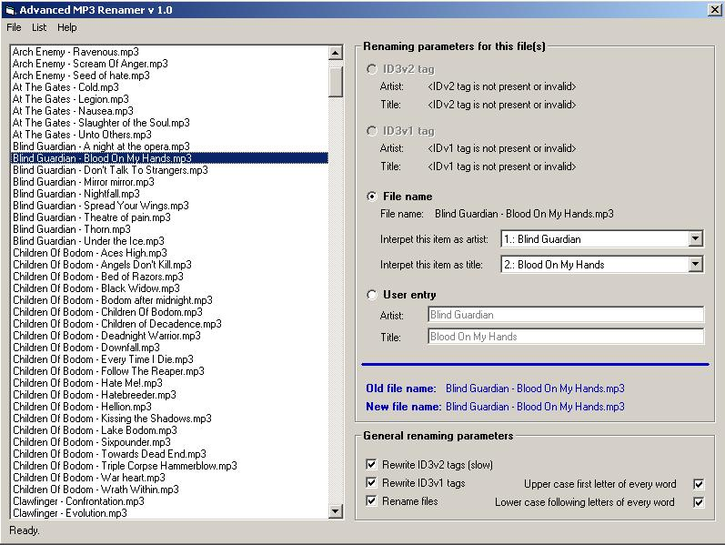



## Advanced MP3 renamer

### Description

This is an advanced MP3 renamer, including an ID3v1 and ID3v2 tag reading AND writing class! The program is easy to use and uses very intelligent file analysing algorithms. MP3 renamer reads out the ID3v1 tags, ID3v2 tags and file names and analyses them to generate a new file name. I'm sure you'll be surprised in how many cases this will work well. But you also have the possibility to alter the data analysing results manually on a per file basis. MP3 renamer will then rewrite the ID3v1 and ID3v2 tags and, of course, will rename the file so that you're going to have perfectly named MP3 files.
 
### More Info
 

             |
---                |---
**Submitted On**   |2004-03-12 15:38:18
**By**             |[Mathias Kunter](https://github.com/Planet-Source-Code/PSCIndex/blob/master/ByAuthor/mathias-kunter.md)
**Level**          |Advanced
**User Rating**    |5.0 (70 globes from 14 users)
**Compatibility**  |VB 6\.0
**Category**       |[Sound/MP3](https://github.com/Planet-Source-Code/PSCIndex/blob/master/ByCategory/sound-mp3__1-45.md)
**World**          |[Visual Basic](https://github.com/Planet-Source-Code/PSCIndex/blob/master/ByWorld/visual-basic.md)
**Archive File**   |[Advanced\_M1720433152004\.zip](https://github.com/Planet-Source-Code/mathias-kunter-advanced-mp3-renamer__1-52400/archive/master.zip)

